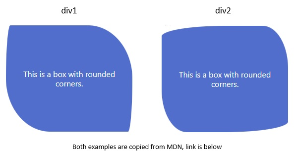

# Frontend Mentor - Order summary component

This is a solution to the [Order summary component](https://www.frontendmentor.io/challenges/order-summary-component-QlPmajDUj). Frontend Mentor challenges help you improve your coding skills by building realistic projects. 

## Table of contents

- [Overview](#overview)
  - [The challenge](#the-challenge)
  - [Screenshot](#screenshot)
  - [Links](#links)
- [My process](#my-process)
  - [Built with](#built-with)
  - [What I learned](#what-i-learned)
  - [Continued development](#continued-development)
  - [Useful resources](#useful-resources)
- [Author](#author)
- [Acknowledgments](#acknowledgments)

## Overview

### The challenge

Users should be able to:

- View the optimal layout depending on their device's screen size
- See hover states for interactive elements

### Screenshot

| Desktop layout |
|:--:|


| Mobile layout |
|:--:|


### Links

- Solution URL: https://github.com/PavlinaPs/order-summary-component
- Live Site URL: https://pavlinaps.github.io/order-summary-component/

## My process

### Built with

- Semantic HTML5 markup
- CSS custom properties
- Flexbox
- Mobile-first workflow

### What I learned

In this challenge I learned more about border radius. I new it is a shorthand but when I looked it up on MDN (link below), I was suprised how many shapes I can create with it. For exapmple: 

```css
.div1 {
  border-radius: 10px 100px / 120px;
}
```
or
```css
.div2 {
  border-radius: 50% 20% / 10% 40%;
}
```



I also tried both ways to add the illustration - as an \ or a background-image in css. I decided for \ because the illustration as a background-image had a blue line on the bottom and I have not figured out where it came from.

### Continued development

I would like find a better way how to match gaps between components better and also look thoroughly on accessibility of this component.

### Useful resources

- MDN on [border-radius](https://developer.mozilla.org/en-US/docs/Web/CSS/border-radius)

## Author

- GitHub - [PavlinaPs](https://github.com/PavlinaPs)
- Frontend Mentor - [@PavlinaPs](https://www.frontendmentor.io/profile/PavlinaPs)

## Acknowledgments

It is great that I can solve Frontend Mentor's challenges. They are all very useful for me. Thank you!

Now I am going to watch Kevin Powell solving this challenge on YouTube. A big thank you here too. I hope I can get a little bit better every time!
